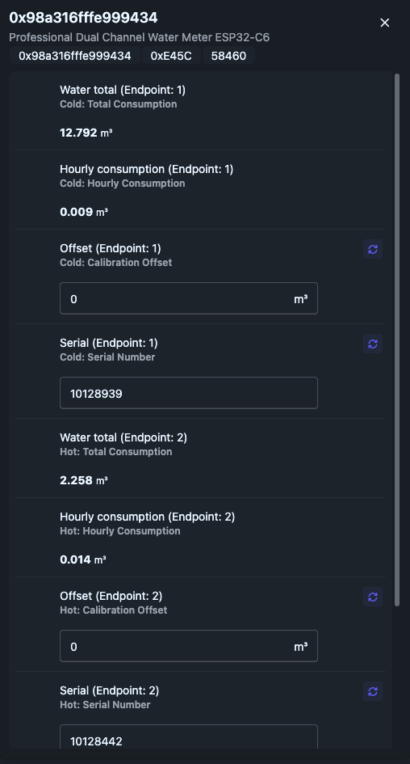

# ESP32-C6 Zigbee Water Meter


A professional, dual-channel Zigbee water meter firmware for ESP32-C6. Designed to interface with both smart RS485 meters (Modbus) and traditional pulse-output meters.

## Screenshots

### Zigbee2MQTT Integration



*Live view showing dual-channel water metering with hourly consumption tracking, configurable offsets, and serial number management.*

## Features

*   **Dual Channel Support:** Monitor Cold and Hot water usage simultaneously.
*   **Hybrid Input Modes:**
    *   **Smart Mode:** Reads digital data (Total Volume, Serial Number) via RS485 (currently supports [Pulsar Du 15/20](https://pulsarm.ru/products/schetchik-vody/kvartirnyy-schyetchik-vody-du-15-du-20/elektronnyy-schetchik-du15-rs-485-qn-1-5-m3-ch-l-110mm/)).
    *   **Pulse Mode:** Counts physical pulses from reed switches or open-collector outputs.
    *   **Test Mode:** Simulated data for development and testing.
*   **Zigbee 3.0 End Device:**
    *   **Deep sleep optimization:** Automatic light/deep sleep between polling cycles (60s threshold).
    *   **Power efficient:** ~21 mA average consumption with 5-minute polling intervals.
    *   Reports Total Volume (m³) and Hourly Consumption.
    *   Configurable via Zigbee (Offset, Serial Number).
    *   Battery status reporting every 30 minutes.
    *   Periodic heartbeat reports (30-minute intervals).
*   **Data Safety:**
    *   Auto-saves readings to NVS (Non-Volatile Storage) to survive power loss.
    *   Wear-leveling protection (saves every 15 mins or on config change).
    *   Emergency recovery mode via boot button.
*   **Enterprise Architecture:**
    *   Modern C++17 with smart pointers and RAII.
    *   Modular design using Factory Pattern and Dependency Injection.
    *   Non-blocking state machine for Zigbee reporting.
    *   Defensive error handling with null pointer checks.
    *   Production-ready logging and diagnostics.

## Hardware

*   **Microcontroller:** ESP32-C6 (e.g., SuperMini C6).
*   **Communication:** RS485 Transceiver (MAX485/MAX3485) for Smart mode.
*   **Power Supply:** 5V USB or external DC with RS485 power control (GPIO 18).
*   **Sensors:** Pulse meters or RS485 Modbus meters.

### Pinout Configuration

| Peripheral | GPIO Pin | Note |
| :--- | :--- | :--- |
| **RGB LED** | 8 | WS2812 / Neopixel status indicator |
| **Button** | 9 | Boot/Config/Factory Reset |
| **RS485 Power** | 18 | Power control for RS485 bus |
| **RS485 RX** | 21 | Serial1 receive |
| **RS485 TX** | 20 | Serial1 transmit |
| **RS485 EN** | 19 | DE/RE direction control |
| **Pulse Cold** | 10 | Interrupt input (FALLING edge) |
| **Pulse Hot** | 11 | Interrupt input (FALLING edge) |

## Power Consumption

| Mode | Current | Duration (per 5 min cycle) |
| :--- | :--- | :--- |
| Active (RS485 polling) | ~150 mA | ~2 seconds |
| Light Sleep | ~20 mA | ~298 seconds |
| **Average** | **~21 mA** | - |

**Battery Life Estimates:**
- 3000 mAh: ~6 days continuous operation
- 5000 mAh: ~10 days continuous operation

## Installation

1.  **Environment:** PlatformIO or Arduino IDE with ESP32 Arduino Core (v3.0+).
2.  **Board Settings:**
    *   **Board:** ESP32-C6 (e.g., `esp32-c6-devkitc-1`).
    *   **Zigbee Mode:** End Device ⚠️ **CRITICAL** - Must select "End Device" mode in Tools menu.
    *   **Partition Scheme:** Zigbee 8MB with SPIFFS.
    *   **Upload Speed:** 921600.
3.  **Configuration:**
    Open `main/main.ino` and adjust the configuration section:
    ```cpp
    /* PRODUCT CONFIGURATION */
    constexpr uint32_t HEARTBEAT_INTERVAL = 60000 * 30;         // 30 min
    constexpr uint32_t BATTERY_REPORT_INTERVAL = 60000 * 30;   // 30 min
    constexpr uint32_t COLD_POOL_INTERVAL = 60000 * 5;         // 5 min polling
    constexpr uint32_t HOT_POOL_INTERVAL  = 60000 * 5;         // 5 min polling
    constexpr uint32_t DEEP_SLEEP_THRESHOLD = 60;              // 60s idle before deep sleep
    constexpr uint32_t LOOP_IDLE_DELAY = 5000;                 // 5s loop delay
    
    constexpr Source::SourceType COLD_TYPE = Source::SourceType::Smart; // or Pulse, Test
    constexpr Source::SourceType HOT_TYPE = Source::SourceType::Smart;
    
    constexpr Driver::MeterModel COLD_DRV_MODEL = Driver::MeterModel::Pulsar_Du_15_20;
    constexpr Driver::MeterModel HOT_DRV_MODEL = Driver::MeterModel::Pulsar_Du_15_20;
    ```
4.  **Flash:** Upload the firmware to your board.

## Architecture

```
┌─────────────────────────────────────────────────────────────┐
│                     Main Loop (Non-blocking)                │
│  ┌──────────────┐  ┌───────────────┐  ┌──────────────┐      │
│  │updateSources │→ │handleZigbee   │→ │updateStatus  │      │
│  └──────────────┘  │Reporting      │  └──────────────┘      │
│                    │(State Machine)│                        │
│                    └───────────────┘                        │
└─────────────────────────────────────────────────────────────┘
         ↓                    ↓                    ↓
┌────────────────┐  ┌────────────────┐  ┌────────────────┐
│ Source Layer   │  │ Zigbee Layer   │  │ Hardware Layer │
│ - SmartSource  │  │ - WaterMeter   │  │ - RS485Stream  │
│ - PulseSource  │  │ - Reporting    │  │ - Utils (LED)  │
│ - TestSource   │  │ - Sleep Mgmt   │  │ - NVS Storage  │
└────────────────┘  └────────────────┘  └────────────────┘
         ↓
┌────────────────┐
│ Driver Layer   │
│ - Pulsar_Du_15 │
│ - MockDriver   │
└────────────────┘
```

### Key Components

- **Factory Pattern:** Creates Sources and Drivers dynamically based on configuration
- **State Machine:** Non-blocking Zigbee reporting with deferred execution
- **RAII:** Smart pointers (`std::unique_ptr`) for automatic resource management
- **Sleep Optimization:** Configurable thresholds for light/deep sleep transitions

## Zigbee Integration

### Pairing
1.  Hold the **BOOT button (GPIO 9)** for **3 seconds** until the LED flashes Red.
2.  The device will reset and enter pairing mode.
3.  The LED will flash Green/Yellow during connection attempts.
4.  Once connected, the LED will turn off (sleeping).

### Zigbee2MQTT
A custom converter is required to expose all features (Offsets, Serial Numbers, Hourly stats).
Copy `water_meter_converter.js` to your Zigbee2MQTT configuration folder and add it to `configuration.yaml`:

```yaml
external_converters:
  - water_meter_converter.js
```

### Attributes & Clusters

| Cluster | Attribute ID | Name | Type | Access | Description |
| :--- | :--- | :--- | :--- | :--- | :--- |
| **Metering (0x0702)** | 0x0000 | CurrentSummDelivered | u48 | R | Total Volume (m³ × 1000) |
| **Metering** | 0x0400 | InstantaneousDemand | u32 | R | Last Hour Consumption (Liters) |
| **Metering** | 0x0100 | CurrentTier1SummDelivered | u48 | RW | Calibration Offset (Liters) |
| **Metering** | 0x0102 | CurrentTier2SummDelivered | u48 | RW | Meter Serial Number |
| **Power Config (0x0001)** | 0x0021 | BatteryPercentage | u8 | R | Battery level (0-200) |

### Reporting Behavior

- **Heartbeat:** Every 30 minutes (both channels report total volume)
- **On-change:** Instant report when value changes
- **Hourly stats:** Automatically reported when hour changes
- **Battery:** Every 30 minutes
- **Initial config:** 5 seconds after connection (Serial Number + Offset)

## Usage

### LED Status Indicators
*   **Solid Red:** Booting / Initialization.
*   **Cyan Flash:** Received command from Zigbee Coordinator.
*   **White Flash:** Data transmitted successfully.
*   **Red Flash:** Connection lost or Reset triggered.
*   **Yellow Blink:** Searching for network.
*   **Dim Green:** Connected and operational (heartbeat).

### Button Functions
*   **Long Press (>3s):** Factory Reset - Erases all Zigbee credentials and NVS data, then restarts.
*   **Hold at Boot (>3s):** Emergency Recovery - Erases NVS and Zigbee storage for corrupted firmware recovery.

### Serial Monitoring

Connect at **115200 baud** to see diagnostic output:

```
*** POWER-ON or RESET (not from deep sleep) ***
Loaded config -> Cold SN:10128442, Cold Off:0, Hot SN:10128939, Hot Off:0
Zigbee: Sleep enabled with 60s threshold for deep sleep optimization
--- System initialized and running ---
Application: Zigbee.connected() is true. Main logic is now active.
Source: Polling for new data...
>>> TX [10128939] Vol: 10 12 89 39 01 0E 01 00 00 00 00 01 FD 0E
<<< RX [10128939]: 10 12 89 39 01 0E B4 A3 4C 41 00 01 65 F6
Zigbee: Reporting initial config...
System: Loop alive. Connected=YES, Uptime=2 min, SleepCycleDuration=122811 ms
```

### Troubleshooting

**Device won't pair:**
1. Ensure "End Device" mode is selected in Arduino IDE Tools menu
2. Hold BOOT button for 3+ seconds to force factory reset
3. Check coordinator is in pairing mode
4. Verify partition scheme includes Zigbee storage

**RS485 not working:**
- Check wiring: A/B polarity, 120Ω termination resistor
- Verify GPIO 18 (RS485_POWER_PIN) is HIGH after connection
- Monitor Serial for TX/RX messages
- Test with single meter first

**High power consumption:**
- Verify `esp_zb_sleep_enable(true)` is called
- Check `DEEP_SLEEP_THRESHOLD` and `LOOP_IDLE_DELAY` values
- Monitor "SleepCycleDuration" in logs (should be ~120s)
- Ensure no blocking operations in main loop

**Data loss after reboot:**
- Auto-save occurs every 15 minutes
- Manual save on config changes via Zigbee
- Hold BOOT during startup = recovery mode (data loss)

## License

Copyright 2026 Andrey Nemenko.

---

## Development Notes

### Code Style
- **Google C++ Style Guide** compliance
- 2-space indentation, no tabs
- CamelCase for classes/functions, snake_case for variables
- `constexpr` for compile-time constants
- `std::unique_ptr` for ownership, raw pointers for observers

### Testing Modes
Enable test mode for rapid development:
```cpp
constexpr bool kEnableTestIntervals = true;  // 10s hourly, 20s daily reports
constexpr Source::SourceType COLD_TYPE = Source::SourceType::Test;  // Simulated data
```

### Adding New Meter Drivers
1. Inherit from `Driver::SmartMeterDriver` in `drivers/`
2. Implement `readVolumeFloat()` and `readSerialNumber()`
3. Register in `DriverFactory::create()`
4. Update `Driver::MeterModel` enum

### Performance Metrics
- Loop execution: ~5ms per iteration (idle)
- RS485 transaction: ~1-2 seconds per meter
- Zigbee report: ~100ms average
- NVS write: ~50ms
- Sleep cycle: ~120s between activity bursts

### Known Limitations
- Deep sleep resets `millis()` counter
- Serial output stops during deep sleep (by design)
- Maximum 2 channels per device (hardware constraint)
- RS485 baud rate fixed at 9600 (Pulsar protocol)
