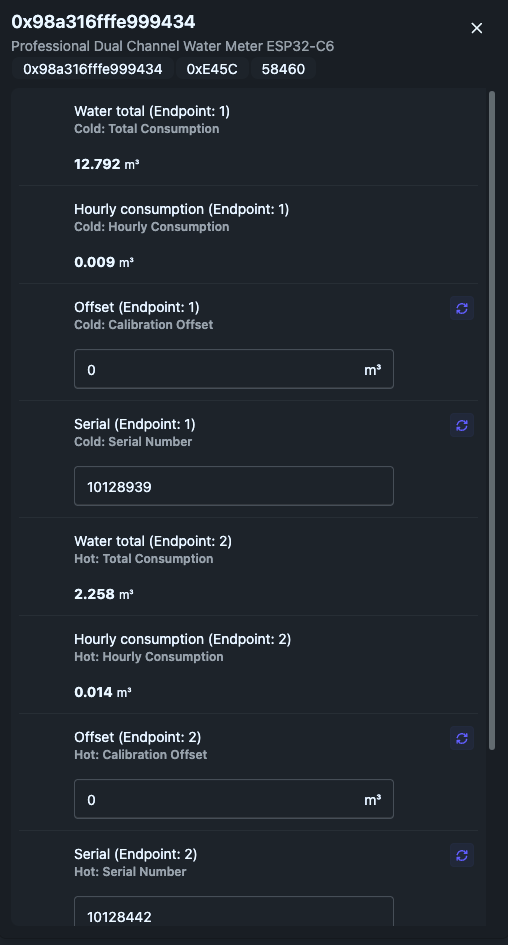

# ESP32-C6 Zigbee Water Meter


A professional, dual-channel Zigbee water meter firmware for ESP32-C6. Designed to interface with both smart RS485 meters (Modbus) and traditional pulse-output meters.

## Build Status

GitHub Actions builds the supported PlatformIO environments on every pull request and every push to `main`. A GitHub Release with firmware binaries is created only for a tag that matches the version declared in `VERSION`.

## Screenshots

### Zigbee2MQTT Integration



*Live view showing dual-channel water metering with hourly consumption tracking, configurable offsets, and serial number management.*

## Features

*   **Dual Channel Support:** Monitor Cold and Hot water usage simultaneously.
*   **Hybrid Input Modes:**
    *   **Smart Mode:** Reads digital data (Total Volume, Serial Number) via RS485 (currently supports [Pulsar Du 15/20](https://pulsarm.ru/products/schetchik-vody/kvartirnyy-schyetchik-vody-du-15-du-20/elektronnyy-schetchik-du15-rs-485-qn-1-5-m3-ch-l-110mm/)).
    *   **Pulse Mode:** Counts physical pulses from reed switches or open-collector outputs.
    *   **Test Mode:** Simulated data for development and testing.
*   **Zigbee 3.0 End Device:**
    *   **Deep sleep optimization:** Automatic light/deep sleep between polling cycles (60s threshold).
    *   **Power efficient:** ~21 mA average consumption with 5-minute polling intervals.
    *   Reports Total Volume (m³) and Hourly Consumption.
    *   Configurable via Zigbee (Offset, Serial Number).
    *   Battery status reporting every 6 hours in production builds.
    *   Periodic heartbeat reports (30-minute intervals).
*   **Data Safety:**
    *   Auto-saves readings to NVS (Non-Volatile Storage) to survive power loss.
    *   Wear-leveling protection (saves every 15 mins or on config change).
    *   Emergency recovery mode via boot button.
*   **Enterprise Architecture:**
    *   Modern C++17 with smart pointers and RAII.
    *   Modular design using Factory Pattern and Dependency Injection.
    *   Non-blocking state machine for Zigbee reporting.
    *   Defensive error handling with null pointer checks.
    *   Production-ready logging and diagnostics.

## Hardware

*   **Microcontroller:** ESP32-C6 (NanoESP32-C6 compatible board or Seeed XIAO ESP32C6).
*   **Communication:** RS485 Transceiver (MAX485/MAX3485) for Smart mode.
*   **Power Supply:** 5V USB or external DC with RS485 power control (GPIO 18).
*   **Sensors:** Pulse meters or RS485 Modbus meters.

### Pinout Configuration

| Peripheral | GPIO Pin | Note |
| :--- | :--- | :--- |
| **RGB LED** | 8 | WS2812 / Neopixel status indicator |
| **Button** | 9 | Boot/Config/Factory Reset |
| **RS485 Power** | 18 | Power control for RS485 bus |
| **RS485 RX** | 21 | Serial1 receive |
| **RS485 TX** | 20 | Serial1 transmit |
| **RS485 EN** | 19 | DE/RE direction control |
| **Pulse Cold** | 10 | Interrupt input (FALLING edge) |
| **Pulse Hot** | 11 | Interrupt input (FALLING edge) |
| **Battery ADC** | board-specific | Input voltage measurement via divider |
| **Battery ADC Enable** | optional | Powers the measurement divider when configured |

### Battery Measurement

System battery reporting uses a separate Zigbee Power Config endpoint. The ADC path supports:

- optional divider enable pin: `ADC_BATTERY_ENABLE_PIN` (`-1` disables it)
- enable polarity: `ADC_BATTERY_ENABLE_ACTIVE_LOW`
- divider settle time: `ADC_BATTERY_POWER_SETTLE_MS`
- averaged ADC reads: `ADC_BATTERY_SAMPLES` and `ADC_BATTERY_SAMPLE_DELAY_MS`
- placeholder calibration: `ADC_BATTERY_VOLTAGE_SCALE` and `ADC_BATTERY_VOLTAGE_OFFSET_MV`
- placeholder battery curve points: `ADC_BATTERY_CURVE_*_MV`

The default values are intentionally fake and should be replaced after measuring the real divider with a multimeter.

## Power Consumption

Power numbers are hardware-dependent and should be re-measured after the final RS485 module, battery divider, and regulator are selected.

| Mode | Current | Notes |
| :--- | :--- | :--- |
| Active (RS485 polling) | TBD | RS485 converter and meter-dependent |
| Zigbee interview/configuration window | TBD | Device stays awake after join |
| Light/deep sleep | TBD | Depends on board regulator and external pull-ups |
| Battery measurement | TBD | Optional divider enable pin can reduce standby drain |

The firmware supports a switched battery divider via `ADC_BATTERY_ENABLE_PIN`, averaged ADC reads, and 6-hour production battery reporting.

## Installation

1.  **Install PlatformIO:**

    ```bash
    python -m pip install -r requirements.txt
    ```

2.  **Choose an environment:**

    | Environment | Board | Purpose |
    | :--- | :--- | :--- |
    | `nano-c6-prod` | ESP32-C6 DevKit compatible / NanoESP32-C6 | Production firmware |
    | `nano-c6-test` | ESP32-C6 DevKit compatible / NanoESP32-C6 | Fast test intervals and simulated sources |
    | `xiao-c6-prod` | Seeed XIAO ESP32C6 | Production firmware |
    | `xiao-c6-test` | Seeed XIAO ESP32C6 | Fast test intervals and simulated sources |

3.  **Build:**

    ```bash
    pio run -e nano-c6-prod
    ```

4.  **Flash:**

    ```bash
    pio run -e nano-c6-prod -t upload
    ```

5.  **Monitor serial output:**

    ```bash
    pio device monitor -b 115200
    ```

Hardware pins, ADC calibration placeholders, and board-specific overrides live in `platformio.ini`. Application timing and source mode defaults are in `main/main.cpp`.

## CI/CD

The GitHub Actions workflow in `.github/workflows/build-and-version.yml` performs:

- version resolution from `VERSION`
- Python and PlatformIO setup
- generated `include/version.h` for the current build through `scripts/generate_version.py`
- syntax check for `water_meter_converter_en.js` and `water_meter_converter_ru.js`
- firmware build for the supported PlatformIO environments
- firmware artifact upload for every CI run
- Zigbee2MQTT converter artifact upload for every CI run
- GitHub Release creation only when pushing the matching tag, for example `v0.1.0` when `VERSION` contains `0.1.0`
- release tags require a matching `CHANGELOG.md` section such as `## [0.1.0] - 2026-06-01`

Branch builds use a development firmware version such as `0.1.0-dev+abc1234`. Release assets are named by environment, for example `zigbee_water_meter_xiao-c6-prod.bin`.

Release checklist:

1. Run `python scripts/release.py --version 0.1.0`.
2. Review `VERSION`, `CHANGELOG.md`, and `include/version.h`.
3. Run `python scripts/release.py --commit --tag --push`.

The workflow rejects release tags that do not match `VERSION` or do not have a matching changelog section.

## Architecture

```
┌─────────────────────────────────────────────────────────────┐
│                     Main Loop (Non-blocking)                │
│  ┌──────────────┐  ┌───────────────┐  ┌──────────────┐      │
│  │updateSources │→ │handleZigbee   │→ │updateStatus  │      │
│  └──────────────┘  │Reporting      │  └──────────────┘      │
│                    │(State Machine)│                        │
│                    └───────────────┘                        │
└─────────────────────────────────────────────────────────────┘
         ↓                    ↓                    ↓
┌────────────────┐  ┌────────────────┐  ┌────────────────┐
│ Source Layer   │  │ Zigbee Layer   │  │ Hardware Layer │
│ - SmartSource  │  │ - WaterMeter   │  │ - RS485Stream  │
│ - PulseSource  │  │ - Reporting    │  │ - Utils (LED)  │
│ - TestSource   │  │ - Sleep Mgmt   │  │ - NVS Storage  │
└────────────────┘  └────────────────┘  └────────────────┘
         ↓
┌────────────────┐
│ Driver Layer   │
│ - Pulsar_Du_15 │
│ - MockDriver   │
└────────────────┘
```

### Key Components

- **Factory Pattern:** Creates Sources and Drivers dynamically based on configuration
- **State Machine:** Non-blocking Zigbee reporting with deferred execution
- **RAII:** Smart pointers (`std::unique_ptr`) for automatic resource management
- **Sleep Optimization:** Configurable thresholds for light/deep sleep transitions

## Zigbee Integration

### Pairing
1.  Hold the **BOOT button (GPIO 9)** for **3 seconds** until the LED flashes Red.
2.  The device will reset and enter pairing mode.
3.  The LED will flash Green/Yellow during connection attempts.
4.  Once connected, the LED will turn off (sleeping).

### Zigbee2MQTT
A custom converter is required to expose all features (Offsets, Serial Numbers, Hourly stats).
Copy one converter to your Zigbee2MQTT configuration folder:

- `water_meter_converter_en.js` - English labels.
- `water_meter_converter_ru.js` - Russian labels.

Enable only one of them because both describe the same Zigbee model. Add the selected file to `configuration.yaml`:

```yaml
external_converters:
  - water_meter_converter_en.js
```

### Attributes & Clusters

| Cluster | Attribute ID | Name | Type | Access | Description |
| :--- | :--- | :--- | :--- | :--- | :--- |
| **Metering (0x0702)** | 0x0000 | CurrentSummDelivered | u48 | R | Total volume (m3 x 1000) |
| **Metering** | 0x0400 | InstantaneousDemand | u32 | R | Current flow rate (m3/h x 1000) |
| **Metering** | 0xE000 | HourlyConsumption | u32 | R | Last closed hour consumption (m3 x 1000) |
| **Metering** | 0xE001 | RefreshRequest | u8 | W | Forces a fresh meter poll |
| **Metering** | 0xE002 | PollIntervalMinutes | u16 | RW | Meter poll interval in minutes |
| **Metering** | 0xE003 | MeterBatteryVoltage | u16 | R | Smart meter battery voltage in millivolts, reported only after a successful read |
| **Metering** | 0x0100 | CurrentTier1SummDelivered | u48 | RW | Calibration Offset (Liters) |
| **Metering** | 0x0102 | CurrentTier2SummDelivered | u48 | RW | Meter Serial Number |
| **Power Config (0x0001)** | 0x0021 | BatteryPercentage | u8 | R | Battery level (0-200) |

### Reporting Behavior

- **Heartbeat:** Every 30 minutes (both channels report total volume)
- **On-change:** Instant report when value changes
- **Flow rate:** Reported with regular value reports as m3/h
- **Hourly stats:** Automatically reported when hour changes
- **Manual refresh:** Writing `refresh` from Zigbee2MQTT forces the next poll cycle
- **Poll interval:** Configurable per endpoint in Zigbee2MQTT, stored in NVS
- **Smart meter battery:** Reported per endpoint only when the meter provides a valid value
- **Battery:** Every 6 hours in production builds; every 60 seconds in test builds
- **Initial config:** 5 seconds after connection (Serial Number + Offset)

## Usage

### LED Status Indicators
*   **Solid Red:** Booting / Initialization.
*   **Cyan Flash:** Received command from Zigbee Coordinator.
*   **White Flash:** Data transmitted successfully.
*   **Red Flash:** Connection lost or Reset triggered.
*   **Yellow Blink:** Searching for network.
*   **Dim Green:** Connected and operational (heartbeat).

### Button Functions
*   **Long Press (>3s):** Factory Reset - Erases all Zigbee credentials and NVS data, then restarts.
*   **Hold at Boot (>3s):** Emergency Recovery - Erases NVS and Zigbee storage for corrupted firmware recovery.

### Serial Monitoring

Connect at **115200 baud** to see diagnostic output:

```
*** POWER-ON or RESET (not from deep sleep) ***
Loaded config -> Cold SN:10128442, Cold Off:0, Hot SN:10128939, Hot Off:0
Zigbee: Sleep enabled with 60s threshold for deep sleep optimization
--- System initialized and running ---
Application: Zigbee.connected() is true. Main logic is now active.
Source: Polling for new data...
>>> TX [10128939] Vol: 10 12 89 39 01 0E 01 00 00 00 00 01 FD 0E
<<< RX [10128939]: 10 12 89 39 01 0E B4 A3 4C 41 00 01 65 F6
Zigbee: Reporting initial config...
System: Loop alive. Connected=YES, Uptime=2 min, SleepCycleDuration=122811 ms
```

### Troubleshooting

**Device won't pair:**
1. Ensure "End Device" mode is selected in Arduino IDE Tools menu
2. Hold BOOT button for 3+ seconds to force factory reset
3. Check coordinator is in pairing mode
4. Verify partition scheme includes Zigbee storage

**RS485 not working:**
- Check wiring: A/B polarity, 120Ω termination resistor
- Verify GPIO 18 (RS485_POWER_PIN) is HIGH after connection
- Monitor Serial for TX/RX messages
- Test with single meter first

**High power consumption:**
- Verify `esp_zb_sleep_enable(true)` is called
- Check `DEEP_SLEEP_THRESHOLD` and `LOOP_IDLE_DELAY` values
- Monitor "SleepCycleDuration" in logs (should be ~120s)
- Ensure no blocking operations in main loop

**Data loss after reboot:**
- Auto-save occurs every 15 minutes
- Manual save on config changes via Zigbee
- Hold BOOT during startup = recovery mode (data loss)

## License

Copyright 2026 Andrey Nemenko.

---

## Development Notes

### Code Style
- **Google C++ Style Guide** compliance
- 2-space indentation, no tabs
- CamelCase for classes/functions, snake_case for variables
- `constexpr` for compile-time constants
- `std::unique_ptr` for ownership, raw pointers for observers

### Testing Modes
Enable test mode for rapid development:
```cpp
constexpr bool kEnableTestIntervals = true;  // 10s hourly, 20s daily reports
constexpr Source::SourceType COLD_TYPE = Source::SourceType::Test;  // Simulated data
```

### Adding New Meter Drivers
1. Inherit from `Driver::SmartMeterDriver` in `drivers/`
2. Implement `readVolumeFloat()` and `readSerialNumber()`
3. Register in `DriverFactory::create()`
4. Update `Driver::MeterModel` enum

### Performance Metrics
- Loop execution: ~5ms per iteration (idle)
- RS485 transaction: ~1-2 seconds per meter
- Zigbee report: ~100ms average
- NVS write: ~50ms
- Sleep cycle: ~120s between activity bursts

### Known Limitations
- Deep sleep resets `millis()` counter
- Serial output stops during deep sleep (by design)
- Maximum 2 channels per device (hardware constraint)
- RS485 baud rate fixed at 9600 (Pulsar protocol)
